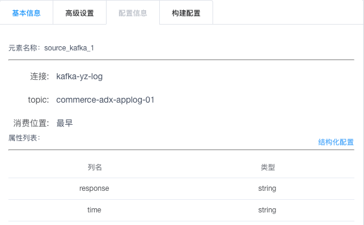
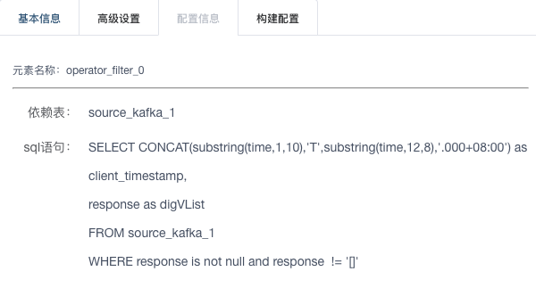
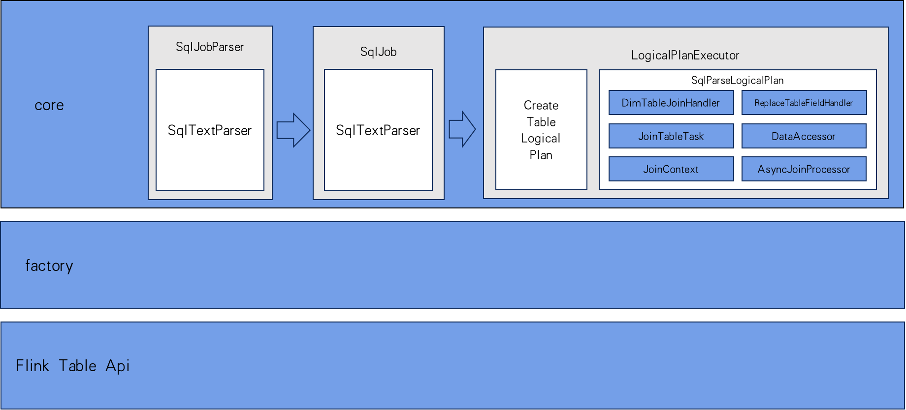

# Streaming SQL在贝壳的演进之路

## 背景

实时计算平台是贝壳内部比较重要的几个平台之一，支持了公司埋点、商机、交易、租赁、商业化等若干部门的业务，运行和管理着共270多个实时计算任务，承接着公司内部重要数据的实时处理工作。而且同时也有越来越多的业务方加入进来，一方面给我们压力，另一方面也促进着我们不断提升我们的能力来支持更多的业务方能够在我们的实时计算平台上更快的开发他们的作业和更方便的使用。

我们都知道SQL作为一种通用的描述数据处理的语言，有着统一的标准和广泛的使用。它的学习成本低，开发效率高，行业内有着完整的生态，成熟的优化规则。但是SQL其实更多的是在线上系统的面向关系数据库的OLTP场景和离线数仓的OLAP场景中使用。那么能否将SQL应用到实时计算的场景来提升实时任务的开发效率呢？

带着这个问题，我们开始了SQL on Streaming的挑战。

## SQL on Streaming

### 问题

我们都知道，SQL是作用在有限数据集上的，查询引擎读取完整可用的数据集，生成固定大小的结果。相比之下，数据流持续提供新的记录，数据随着时间到达，因此流查询必须持续的处理到达的数据。所以问题变成了如何在流上定义一个能够是SQL作用在其上的视图。

### 动态表

动态表概念的提出，用来支持对结果更新的查询，保留流和批输入的统一语义。动态表是一个不断更新的表，可以像常规的表一样进行查询，但是，对动态表的查询是连续运行的，而且根据输入表的不断更新，查询出来的结果表也是不断更新的，因此结果表也是一个动态表。
到这，我们可以理解出其实流和动态表是同一种东西，只是在不同角度看待问题而产生的不同概念罢了，所以二者其实是可以相互转换的，
我们可以将流转换为动态表，也可以将动态表转换为流。下图显示了可以在流上处理关系查询的概念模型。


那么我们如何在流上定义一个动态表？有两种模式：追加和更新。追加模式下，流中的每条新增记录都会插入到动态表中，不会对动态表中的历史数据做修改；


而更新模式下，流中的每条记录都会根据其唯一的健值或新增，或对历史的数据做更新操作。


### 持续查询

由于动态表随时间而变，我们必须定义查询动态表的意义。
假设我们有一个动态表A，那么我们可以定义它在时间t时刻的快照为A[t]，这时就可以使用任意的SQL来对其进行查询，生成一个结果表。我们定义查询的操作为q，将查询作用到A[t]上，我们表示为q(A[t])，生成的结果表R[t]，于是我们有：

```
R[t] = q(A[t])
```

在动态表上的持续查询，表示为在t的每个时间点，都会执行一个t时刻在动态表A上的批量查询，而所生成的结果表也同样是一个持续更新的动态表，它可能会不断更新先前的行，也可能添加新行。

需要注意的是，无论输入表什么时候更新，都不可能计算查询的完整结果。相反，查询编译成流应用，根据输入的变化持续更新它的结果。这意味着不是所有的有效 SQL 都支持，只有那些持续性的、递增的和高效计算的被支持。

好了，理论部分说完了，那么我们如何将SQL on Streaming有效的落地呢。在当时平台的所有任务都还是在使用spark技术栈，而且当时Spark新推出了Structured Streaming模块，因此我们自然而然的将该模块作为我们将SQL on Streaming落地的第一阶段的解决方案。

## SQL 1.0

我们当时调研的版本是2.3.1，是Structured Streaming刚刚推出不久，其虽然支持一些比较复杂的窗口聚合操作，但是限制也比较多，而且其仅在api层面上提供较为完善的语义，而在SQL层面并没有提供较好的支持，而且就平台上的任务来说，也没有在流维关联、窗口聚合这方面有比较强烈的需求，所以我们最初对于产品的定位也仅仅是做一些简单的ETL工作。于是，最初的设计如下：

1. 仅支持简单的select * from xxx where conditions...和union语句
2. 在一个作业里可以以临时视图的形式定义多个逻辑节点，最终视图之间的依赖关系构成了整个作业的DAG
3. 针对上下游数据提供formatter，对上下游的数据提供格式化输入输出的能力。
4. 对不同的外部存储，提供多种适配的组件来支持多种第三方存储的写能力

### 产品展示

下图是我们使用SQL 1.0配置出的一个对业务后端日志做简单ETL的任务。可以看到这里面有五个节点，上游source_kafka_1是读取外部kafka中的后端日志，中间有三个节点，是处理过程，最后绿色的sink_kafka_1是将处理后的数据输出到下游kafka中的topic。


下图是对输入端kafka的配置：



里面包含了要连接的kafka集群名称，订阅的topic，读取数据的格式，字段和类型。对于kafka中的数据格式，我们提供了4种定义schema和解析的方式：

1. 默认：所有数据按一个单独的列提供，不做解析，列名可自定义
2. json：对json做深度解析，以jsonpath的方式定义各列的访问路径。
3. 正则：以正则表达式的形式提取各列数据，匹配出正则中第一组括号的匹配项，此种方式一般用作数据格式不规范的场景
4. 分隔符：可指定自定义分隔符，以索引的方式定义各列数据的访问方式。

此外，在定义中间若干处理节点时，除要配置SQL语句外，还要指定上游依赖的节点：



最后，在配置sink组件时，我们要指定上游的数据依赖，输出到下游的kafka集群名称，topic，和输出数据格式，包括想要的字段名称，字段格式，提供了将string转换成json object/array的能力。


### 产品设计

下面是设计的组件类图：


1. Plugin是所有Source,Operator,Sink的父类
2. UpStream是对所有上游组件的封装，封装了本节点生成的视图名称，所有连接的下游节点，和获取本节点的DataFrame的方法，SqlSource和SqlOperator都可以作为上游组件
3. DownStream是对所有下游组件的封装，维护了所有的上游依赖，SqlOperator和SqlSink都可以作为下游组件。
4. SqlSource是对输入数据源头的封装，提供了构建Formatter的能力
5. SqlOperator是对中间处理节点的封装，目前仅支持简单Filter和Union
6. SqlSink封装了将上游数据输出到外部的能力，目前支持的Sink类型包括kafka，console，druid

目前平台上运行着的SQL 1.0的实时任务有60个，而且数量还在增加。

### 问题

#### checkpoint

我们知道在定义Structured Streaming任务的时候是必须指定checkpoint路径的，而且Structured Streaming底层在做checkpoint的时候是同步的，也就是说会阻塞整体的处理进度。当凌晨有大量离线任务运行导致hdfs繁忙的时候，会导致checkpoint阻塞，从而导致数据的积压和延迟，这对下游一些对实时性要求较高的系统来说是不可接受的。

#### offset

Structured Streaming的消费进度是保存在checkpoint里的，而且每次任务重启都会直接从checkpoint里读取offset，并且会在driver端屏蔽掉自动提交offset功能，如此会有以下几个问题：

1. 消费进度和消费组无关，无法从消费组上共享消费进度。
2. 无法从外部监控到消费进度，积压等情况，不利于任务的监控报警。
3. 重置offset流程复杂。

由于以上原因，以及考虑到后续对业务的支持，构建公司级别的实时数仓，实时指标等能力，我们不得不对SQL on Streaming的能力做整体升级。因此，SQL 2.0应运而生。

## SQL 2.0

首先，我们对SQL 2.0的产品定位为提供一种以纯SQL的方式来定义流式作业。那么围绕这一宗旨，SQL 2.0应该具备哪些能力呢？

1. 定义维表，且能实时维表关联
2. 支持定义逻辑视图
3. 支持自定义UDF
4. 对时间窗口的支持，包括各种分组聚合

在调研了多款开源产品之后我们选择了Flink这款目前最火热的开源流处理框架，它对SQL的支持是目前所有实时处理框架中最好的。
所以我们最终决定在Flink-SQL上做扩展，来实现我们的功能。



### DDL

考虑到在引擎应该只提供能力，而和管理着元数据系统打通应该属于应用层的能力，因此我们初步设计是希望能用一种DDL的方式来打通应用层和引擎层，同时用来定义外部数据源，而Flink SQL中暂还并为提供这种能力。因此，我们基于Antlr4工具，对标准SQL中的DDL语法做了一些扩展，使其不但能够描述外部数据的格式，而且能够提供访问外部数据的一些连接信息，以及提取特定字段的能力。

示例建表语句如下：

```SQL
--定义数据源表
create source table kafka_source_tb (
  system_type string extraction '$.system_type',
  client_os_type string extraction '$.client_os_type',
  ucid string extraction '$.ucid',
  ts bigint extraction '$.timestamp',
  watermark key ts delay for 5s
) with (
  type = 'kafka',
  dataType = 'json',
  brokers = 'off03-bigdata.mars.ljnode.com:9092',
  topics = 'data-pipeline-common-dev',
  groupId = 'test-group'
);

--定义维表
create dim table redis_dim_tb (
  ucid string,
  first_login_time string,
  device_id string,
  primary key ucid
) with (
  type = 'redis',
  server = '127.0.0.1',
  port = '6379',
  cache = 'all'  
);

--定义输出表
create sink table console_sink_tb (
  ucid string,
  first_login_time string,
  device_id string,
  client_os_type string,
  system_type string,
  ts bigint
) with (
  type = 'console',
  dataType = 'json'
);
```
 + with语句块中是对外部数据源的连接描述信息
 + 数据源表中的watermark key $xxx delay for $period为定义水印的语句
 + 维表中的primary key用来定义主键，主要是为了在维表关联时查找外部数据
 
引擎层在执行时，会将source和sink表的定义翻译成底层的flink api，将表信息注册到flink的TableEnvironment中。

### 维表关联

到目前为止，我们已经在SQL 2.0中提供了1.0中的全部能力，理论上已经能够提供给用户做简单的ETL使用了。但是作为一个有理想的青年，我们并不满足于此。而且，为了后续提供构建实时数仓和实时指标的能力，简单的ETL是不够的，我们还要和很多的外部数据做关联。
为了满足这方面的需求，我们基于calcite的SQL解析功能和阿里为社区贡献的Async I/O功能实现了维表关联的能力。下面对这部分功能的设计做详细介绍。

#### 设计

首先，思路就是先解析SQL，如果在join语句后面出现了用户定义的维表，就触发维表关联的SQL改写逻辑，改写逻辑如下：

1. 抽离嵌套子查询，独立注册成临时表
2. 合并流表关联维表节点，提取关联条件
3. 对流表的DataStream做转换，使用Async I/O，访问外部存储做数据关联
4. 替换原SQL语句中所有被流表和维表原表名限定的字段的所属表名，生成新的有效的SQL

这样理解起来可能有些困难，我们在上面三个DDL的基础上举个例子，使用如下DML来定义一个作业：

```SQL
insert into console_sink_tb (
  ucid, first_login_time, device_id,
  client_os_type, system_type)
select 
  ucid, first_login_time, device_id, 
  client_os_type, system_type
from kafka_source_tb a
join redis_dim_tb b
on a.ucid = b.ucid
```

由于本例中不存在嵌套查询，第一步可以跳过。

第二步：合并流维关联节点，提取关联条件。

上述SQL经过SQL解析后，会生成如下语法树：


该语法树经过转换后，变为


翻译成SQL后就是：

```SQL
select 
  a_J_b.ucid,
  a_J_b.first_login_time,
  a_J_b.device_id,
  a_J_b.client_os_type,
  a_J_b.system_type
from a_J_b
```

第三步：对流表的DataStream做转换，使用Async I/O，访问外部存储做数据关联。根据我们前面讲的概念，流和动态表是可以相互转换的，因此，我们可以先将流表转换成DataStream，然后根据维表定义中的连接信息访问外部数据源，再根据提取出的关联条件，获取和过滤出我们需要的数据，实际上是通过RichAsyncFunction提供的异步并行执行的能力，能够同时请求多条数据，提高效率。将关联后的数据流注册成中间表，表名即流维表节点合并的名字（a_J_b)，这样就可以将转换后的SQL语句作用到该表上了。

第四步需要对原SQL语句的where子句或group by子句以`a.client_os_type`的方式中引用到字段的所属表名做替换，将`a`替换成`a_J_b`。因为当我们将流表关联维表合并为一个节点后，原来的`a`已经变成了一个不可识别的标识符了。

#### 缓存优化

在生产环境中，绝大多数的流都是很快的，如果每条数据都要访问一次外部存储，那么，除了整体的性能会差以外，对外部存储也会造成很大压力，甚至会把外部系统压垮。另一方面，考虑到其实很多维表变更并不频繁，而且数量也不会很大，那么，我们完全可以将维表的数据缓存在内存中，设定好过期策略做到异步更新。我们提供了两种缓存，一种是全量缓存，另一种是LRU缓存。

另一方面当数据量比较大时，单节点不足以将绝大多数维度数据缓存，可以预先根据与参与关联的维表主键对应的流表字段做预分区，即根据某一个字段，保证该字段下同值的记录总被分配到同一个下游节点上，这样每个下游节点只缓存本节点能用到的数据，且能保证该部分的值域仅占总量的很小一部分。

#### 关联条件支持表达式

可以看到上述方案虽然解决了流表和维表关联的问题，但是是有很多限制的。比如说我们拿hbase作为维表来举例，就要求关联条件中必须包含hbase的rowkey，而且rowkey必须作为关联条件的一部分，其值是必须能够直接从流表中取到的，也就是要求关联条件中只能是`EQUAL`类型的表达式，而且等号两边必须只能是对列的简单引用。

但是很多时候，hbase的rowkey可能并不是一个单一含义的值，它也可能是一个业务逻辑上的联合主键，需要将多列拼接起来才能构成一个完整的rowkey，这个时候关联条件的限制就成为了一个使用上的痛点，用户当然可以通过定义临时视图的形式绕过在这个限制，但是这样又增加了用户的使用成本，所以我们也集中精力解决了这个问题。

我们看下面这个例子：

```SQL
select a.col1, a.col2, b.coll
from a
join b
on a.col1 + a.col3 = b.col
```

其实思路很简单，我们在关联维表前，需要将流表a转换成DataStream，其实就是在转换的过程中添加一个环节。a中仅包含col1,col2,col3字段，但是关联条件中需要`col1 + col3`，所以我们将表`a`转换成临时视图`__function_tmp_view__0`，它表达的逻辑如下SQL
```SQL
select 
  a.col1, 
  a.col2, 
  a.col3, 
  a.col1 + a.col3 AS __function_tmp_field__0
from a
```

这样关联条件就变成了`__function_tmp_field__0 = b.col`，相当于我们将表达式的值的计算过程移动到了我们自动添加的临时视图中，将计算过程提前了，这样我们在关联的时候就能够直接获取关联条件中所需要的值了。

### 维表的接入

实际上业务方在有维表关联的需求时很多都是希望能够直接关联业务库，但是受限于集群访问业务库的安全和稳定性问题，我提供了一种额外的方式能够将用户的业务库数据通过binlog的方式来实时同步到hbase和redis中，而SQL引擎只需要去和HBase或Redis中的数据做关联就可以了。

目前我们已经支持了HBase,Redis,Http,Phoenix等方式的维表关联。

### 新的问题

以上就是我们在构建Streaming SQL 2.0的过程中遇到的一些问题和解决办法，在SQL 1.0中存在的checkpoint和offset问题在2.0中被框架自身所消化，但也随之给我们带来了新的挑战。

1. Flink内部的状态管理如何优雅的配置和管理起来
2. Flink的checkpoint功能如何利用和管理

等等新问题都需要我们去解决。

## 平台化建设

由于SQL 2.0在我们内部平台上上线不久，目前有27个任务正在运行，覆盖了实时数仓，实时交易，商业化，租赁等业务部门；涉及了ETL，维表关联，数据落地clickhouse等场景。

### 产品展示


实时计算平台目前已经集成了数据源管理功能，用于管理实时领域的结构化数据元信息，用户可以预先配置和共享数据源，数据源可以自动拉取样例数据，生成schema信息。

在SQL 2.0任务配置过程中，用户可以选择已经存在的数据源，后端会自动生成自定义的DDL。这样用户只需编写DML定义处理逻辑就可以了，无需编写复杂的DDL，提升了用户的开发效率。最右侧是对任务中涉及的数据源的管理功能。

另外我们也提供了SQL的语法校验功能，使用antlr4自定义语法文件解析和校验DDL语句，使用calcite解析和校验DML语句，能够做到在线验证SQL语法。
此外，我们也提供了查看执行计划，和在线Debug等功能，能够大大提升用户的开发效率和debug效率。


### 任务运维

目前贝壳的所有实时任务是统一托管在Hermes实时计算平台上的，而SQL 2.0在平台上只是一个特殊的场景任务。整体的任务运维和监控报警由平台统一管控。做到任务指标上报和监控，任务心跳监控，任务失败自动拉起等功能。


## 挑战 && 规划

最后是我们对未来工作的一些思考和规划。

1. 数据血缘管理
2. 数据流量监控
3. 资源自适应
4. 大状态优化和管理
5. 实时数仓
