# 任务提交流程

## 程序启动
程序入口根据bin/flink脚本中的run命令查看到，入口类为flink-clients子模块的CliFrontend类，main方法中，代码如下：
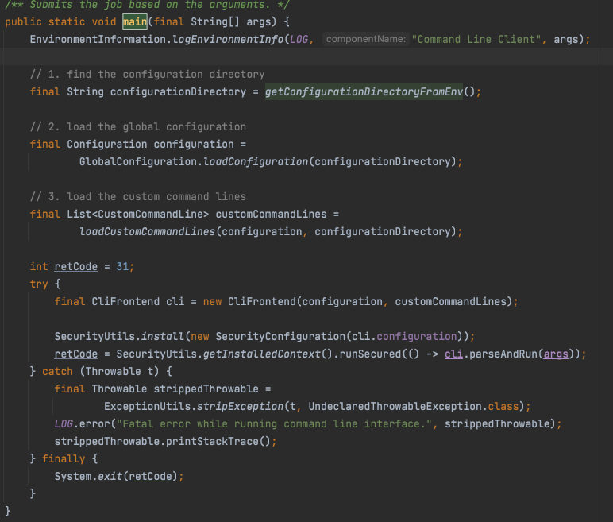

主要逻辑如下：

1. 获取配置文件路径
2. 加载配置文件内容
3. 创建自定义命令行解析器，主要包括集群相关参数和-D参数
4. 创建CliFrontend
5. 执行其parseAndRun方法

parseAndRun方法会根据bin/flink后紧随的第一个参数决定走哪个分支执行命令，这里我们主要看任务提交流程，flink在yarn的运行模式主要分三种，per-job，application和session。其中per-job和session模式通过run命令提交走run方法，application模式通过run-application命令提交，走runApplication方法。

## run方法流程
我们先看run方法，代码如下：
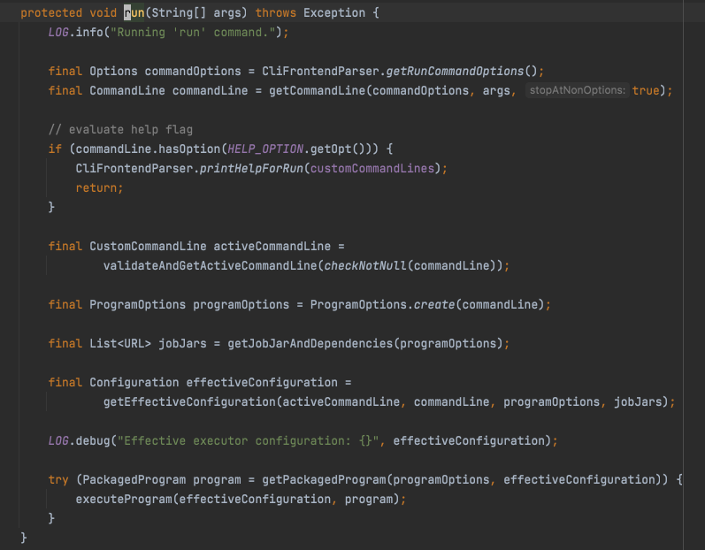

1. 首先解析命令行参数
2. 提取自定义命令行选项
3. 创建程序配置选项，主要包含--class, --classpath, --jarfile, --parallelism等选项
4. 解析jar依赖
5. 提取自定义命令行配置，合并程序参数和pipeline.jars配置项，构造Configuration对象，最为运行时配置
6. 创建PackagedProgram对象，主要包含程序jar，入口类，程序参数，classpath，类加载器等配置
7. 将以上配置作为参数，运行executeProgram

代码进入到ClientUtils.executeProgram中。注意一下第一个参数：DefaultExecutorServiceLoader。
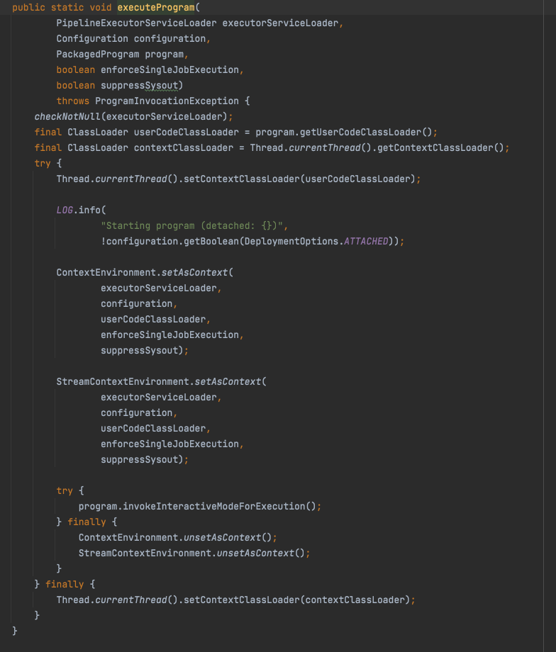

1. 使用用户代码类加载器替换线程类加载器
2. 设置执行环境工厂为ContextEnvironment，流式执行环境工厂为StreamContextEnvironment。同时设置进去的还有配置对象，类加载器，执行服务加载器。
3. 调用用户代码的main方法，此过程构建DAG，调用StreamExecutionEnvironment.execute方法，内部为异步执行，所以不阻塞主流程。
4. 重置执行环境和线程类加载器

我们在代码中调用StreamExecutionEnvironment.getExecutionEnvironment的时候，得到的就是上面第二步中设置的StreamContextEnvironment。如果是本地版运行，则是LocalStreamEnvironment。代码如下：
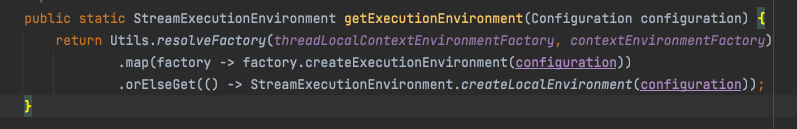

在StreamExecutionEnvironment.execute内部，首先调用getStreamGraph生成第一层的dag图，使用StreamGraph定义，execute()调用链如下：

```
StreamExecutionEnvironment.execute()
-> StreamExecutionEnvironment.execute(String name)
-> StreamExecutionEnvironment.execute(StreamGraph streamGraph)
-> StreamContextEnvironment.executeAsync(StreamGraph streamGraph)
->  StreamExecutionEnvironment.executeAsync(StreamGraph streamGraph)
```
executeAsync代码如下：
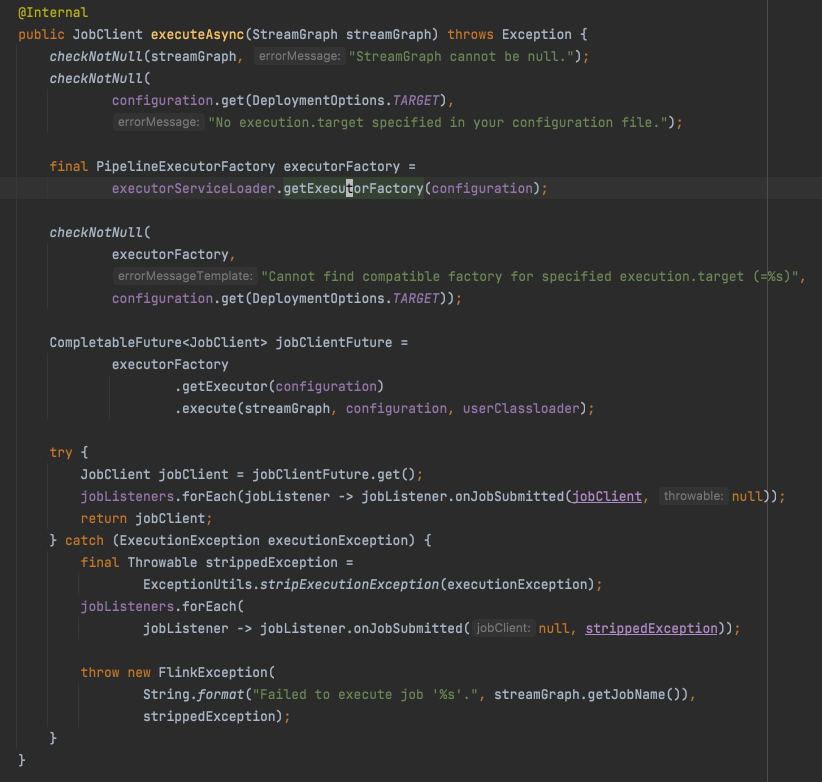

executorServiceLoader是上文提到的DefaultExecutorServiceLoader。其内部通过java spi机制创建一个PipelineExecutorFactory经过一些校验和过滤，根据我们任务提交模式(local, per-job, session)，唯一选择一个factory返回。

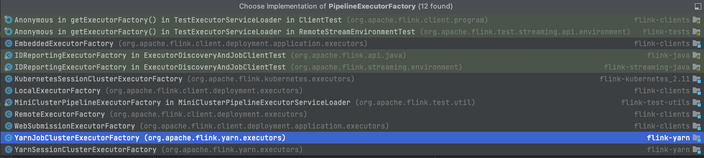
该factory会通过getExecutor方法创建一个PipelineExecutor，用来执行我们构建的dag程序。其主要实现集中在以下几个类中。
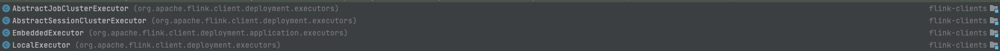

+ 在LocalExecutor中会创建一个MiniCluster用来运行我们的任务。
+ 跟分布式环境相关的主要是AbstractJobClusterExecutor和AbstractSessionClusterExecutor。AbstractJobClusterExecutor仅支持yarn模式，AbstractSessionClusterExecutor同时支持standalone、k8s和yarn。这里我们只讨论yarn。

AbstractSessionClusterExecutor的yarn子类YarnSessionClusterExecutor和AbstractJobClusterExecutor的yarn子类YarnJobClusterExecutor在实例化的时候都对父类传入了同一个类型的YarnClusterClientFactory。

### PerJob模式

我们先看PerJob模式。即YarnJobClusterExecutor和AbstractJobClusterExecutor。继续上面的流程，入口在AbstractJobClusterExecutor的execute方法中。
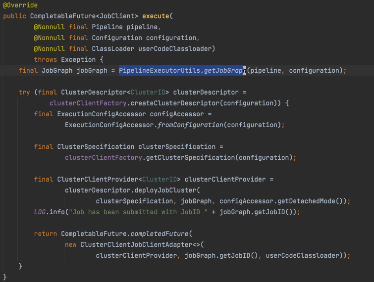

1. 首先调用PipelineExecutorUtils.getJobGraph讲StreamGraph转换成JobGraph。JobGraph是任务提交集群的一个中间状态，剩下的两个阶段转化是在集群上的JM上进行的。
2. 接着调用YarnClusterClientFactory.createClusterDescriptor创建一个yarn集群描述对象内部包含描述一个yarn application的一些信息：YarnClient，要上传的文件，yarn队列，flink框架jar，应用类型，节点label等信息。
3. 创建ExecutionConfigAccessor，封装对Configuration的配置访问
4. 根据配置，实例化集群规格类，用来描述master内存，tm内存，每个tm的slots数
5. 接着调用YarnClusterDescriptor.deployJobCluster将JobGraph提交到yarn集群上运行，核心逻辑在deployInternal中，注意第三个参数YarnJobClusterEntrypoint，是集群进程的入口。

这里代码较长，我文字描述，不贴代码了

1. 首先进行一些基本校验，检查集群资源对比vcore
2. 校验队列是否存在
3. 创建YarnApplication
4. 获得集群当前空闲资源
5. 调用startAppMaster启动AppMaster
    1. 获取yarn application context，设置一些yarn参数
    2. 将所有依赖的jar，设置到上下文中
    3. 将JobGraph序列化为二进制，写入临时文件中，将临时文件注册进上下文
    4. 添加flink-conf.yaml文件到上下文
    5. 添加yarn-site.xml到上下文
    6. 添加keytab授权文件到上下文
    7. 创建JM进程内存描述
    8. 构造JM启动命令，申请container，为container设置环境变量
    9. 将container设置到应用上下文中
    10. 设置yarn队列到上下文
    11. 设置tags到上下文
    12. 提交应用上下文
    13. 等待响应，监控任务状态，RUNNING和FINISHED自动退出
6. 将JM的一些地址信息设置到configuration中。
7. 返回RestClusterClient的provider
8. 后面还有一些收尾代码，此处略过

### Session 模式

接着我们看yarn session模式，session模式需要在提交任务前，先通过脚本启动一个session，获取application\_id，然后在提交任务时将application\_id通过参数-Dyarn.application.id=application\_XXXX\_YY传递进来，代码入口在YarnSessionClusterExecutor和AbstractSessionClusterExecutor类中，继续executeAsync的流程，入口在AbstractSessionClusterExecutor的execute方法中。
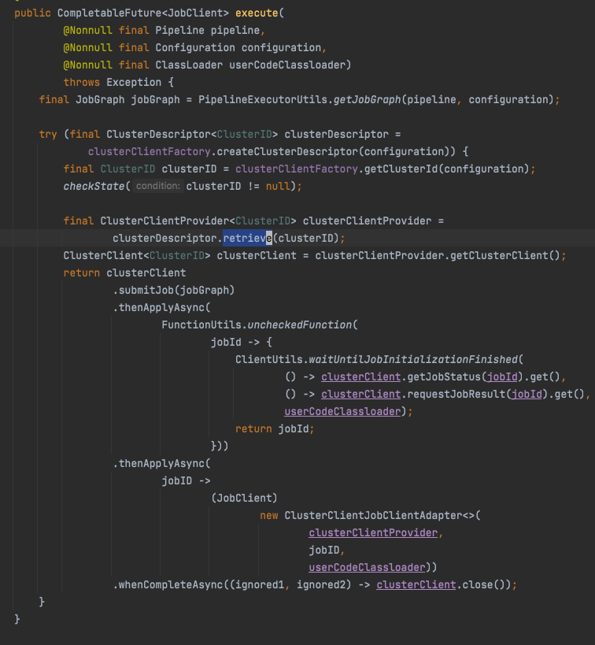

1. 首先调用PipelineExecutorUtils.getJobGraph讲StreamGraph转换成JobGraph。
2. 接着调用YarnClusterClientFactory.createClusterDescriptor创建一个yarn集群描述对象
3. 获取参数传递进来的application\_id，作为clusterId
4. 接着调用YarnClusterClientFactory.retrieve根据clusterId检索一个集群，返回其RestClusterClient对象
5. 调用RestClusterClient的submitJob方法，提交任务。
    1. 首先将JobGraph序列化成二进制，保存为临时文件
    2. 注册所有依赖的jar
    3. 创建JobSubmitRequest，通过RestClient，向webui发送任务提交请求
6. 等待任务初始化完成
7. 关闭RestClient

可以看到session的提交流程比较简单，因为主要启动flink集群的流程都封装在yarn-session脚本中，其java入口类为FlinkYarnSessionCli，感兴趣的可以看这篇[集群启动流程](./集群启动流程.md)

## runApplication流程

application模式是在远端集群执行用户代码的main方法，client段提交代码如下：
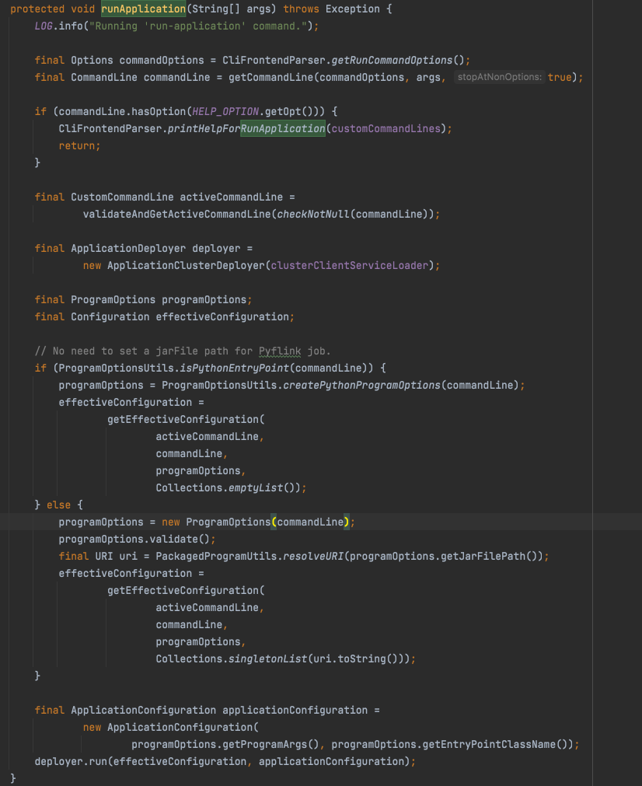
其主要流程和per-job模式有些相似，其区别在于使用使用ApplicationDeployer进行任务的提交和发布。run方法代码如下：
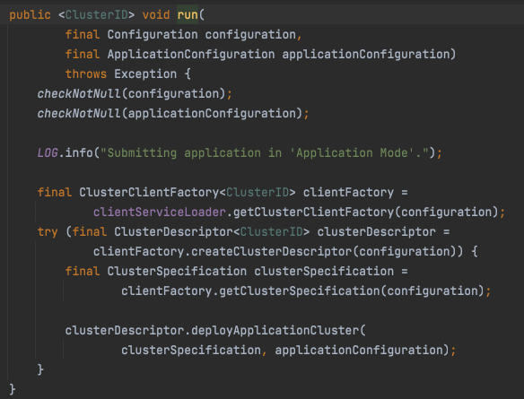

这里的clientServiceLoader是DefaultExecutorServiceLoader，在创建CliFrontend时的一个默认参数，用来创建YarnClusterClientFactory

1. 首先使用javaspi机制加载ClusterClientFactory，这里就是YarnClusterClientFactory，因为还有一个k8s实现，所以这里用的spi动态加载机制
2. 创建集群描述对象
3. 根据配置，实例化集群规格类，用来描述master内存，tm内存，每个tm的slots数
4. 接着调用YarnClusterDescriptor.deployApplicationCluster将应用提交到集群，主要实现为YarnClusterDescriptor.deployApplicationCluster代码如下：
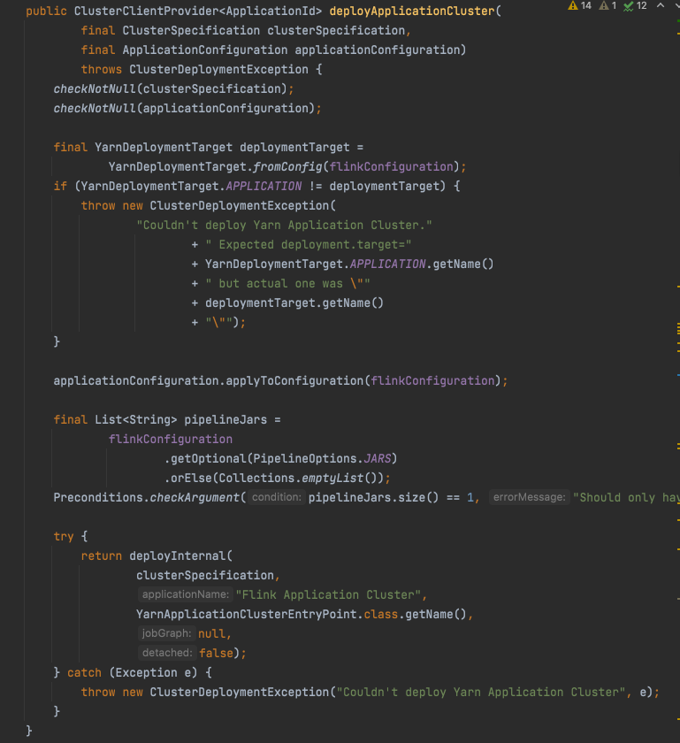
    1. 校验的部分略过，将mainClass和程序参数设置到flinkConfiguration
    2. 设置程序jar
    3. 调用deployInternal，注意此处jobGraph参数为null，说明在整个提交过程是没有JobGraph被序列化和提交到AppMaster的。同时也可以了解到application模式下，集群启动的入口类是YarnApplicationClusterEntryPoint，这个在我们后续的[集群启动流程](./集群启动流程.md)中会继续介绍。deployInternal在上文中已经介绍过了，这里不再赘述。


## 结论
至此，client端的任务提交流程就结束了。剩下的任务的三四阶段转换和调度则是在JM端完成的。可以参考下一节[集群启动流程](./集群启动流程.md)


