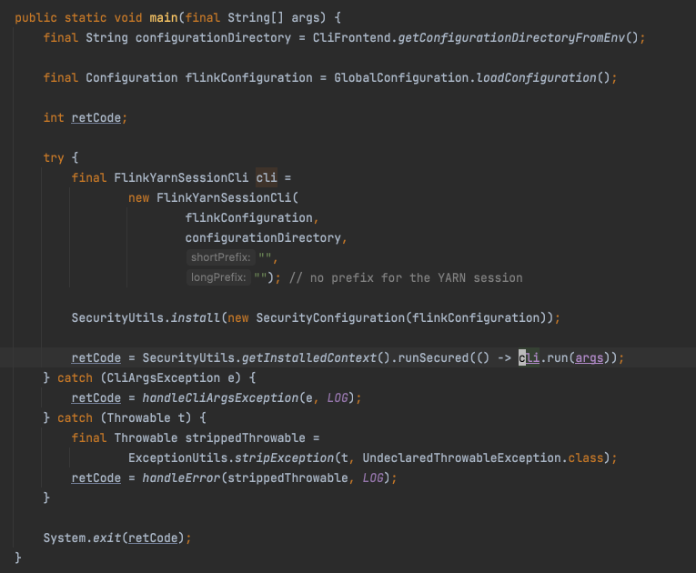
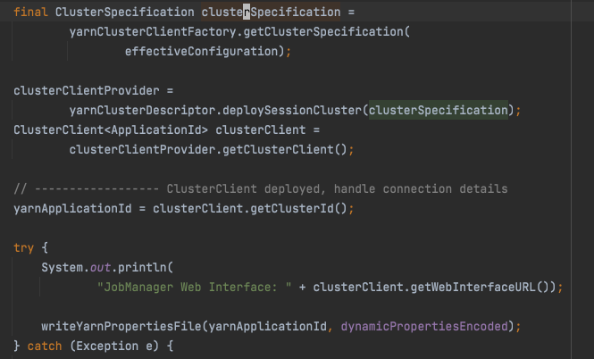
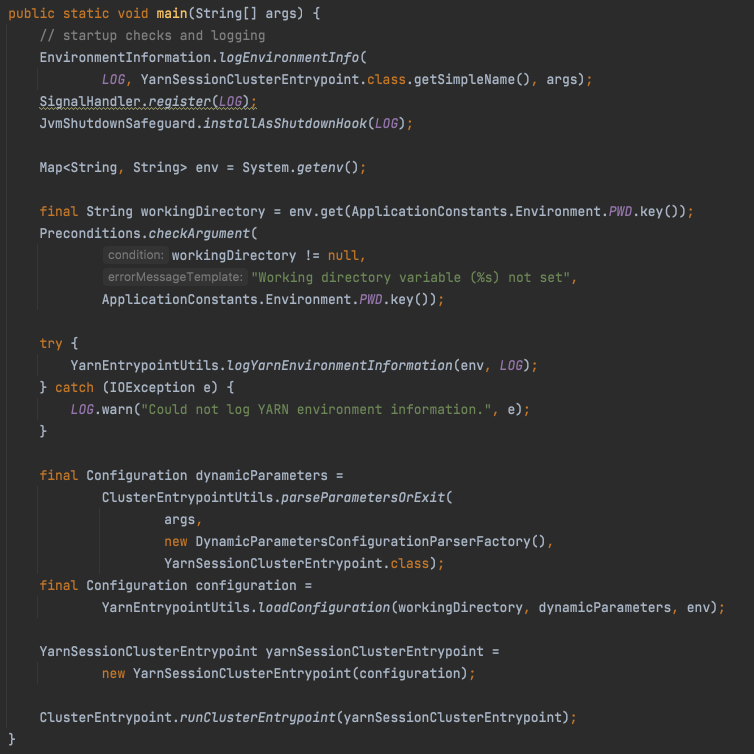
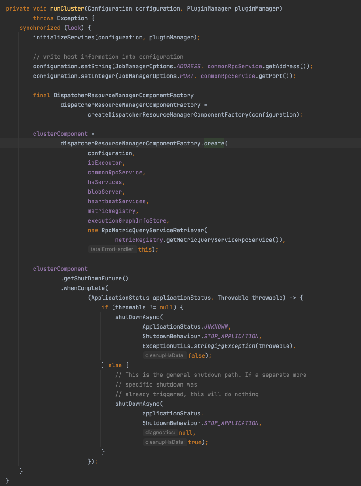
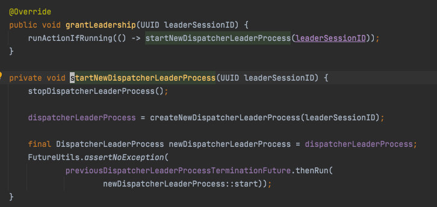
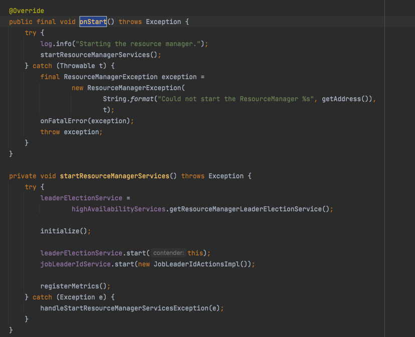
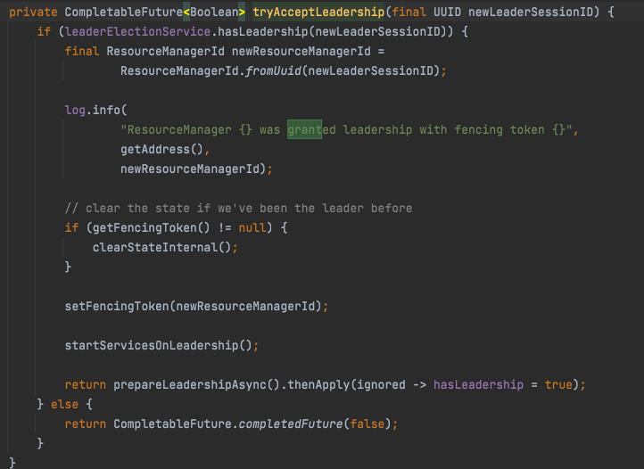
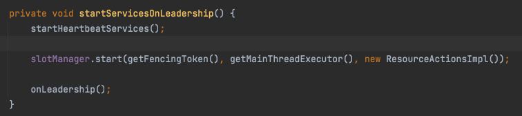

# 集群启动流程

## 简介

Flink任务要提交到yarn集群运行，主要会包含以下几个流程：

1. 在client端提交任务
2. dag序列化成JobGraph
3. 向yarn提交请求，启动flink集群
4. JobGraph转换成ExecutionGraph
5. 申请TM，将ExecutionGraph调度到TM上执行
 
flink提供了三种向yarn提交任务的方式：per-job、application、session。
上述步骤在三中模式间或多或少都存在一些区别，这些步骤每一步都不可或缺，故主要区别在于相互间执行的顺序，以及执行的位置。
下面我们整体串一下JM的启动流程

## 集群启动流程

为了方便理解，我们先以session模式来讲解，帮助大家快速理解主流程，然后再从一些细节点来指出三种模式的区别。为什么选择session模式，因为session模式将集群的启动，和任务的提交调度分成了两部分，更好理解。

### 入口

通过查看flink-dist模块下的yarn-session.sh脚本，我们可以了解到提交session流程的入口类为FlinkYarnSessionCli。下面我们介绍一下提交session的主要流程。程序入口当然在main方法中。


1. 获取配置文件路径
2. 加载配置文件内容
3. 实例化FlinkYarnSessionCli并调用run方法。

run方法代码较长，这里先不贴了

1. 解析命令行参数
2. 通过DefaultClusterClientServiceLoader创建YarnClusterClientFactory。
3. 通过YarnClusterClientFactory创建YarnClusterDescriptor。
4. 下面的流程会有一些分支：
    - 若有query参数，则查询集群规格信息
    - 若有applicationId参数，则查询集群信息，得到RestClusterClient 
    - 若以上参数都没有，说明需要走创建流程

### 提交session请求

部分代码如下：



1. 创建集群规模描述对象
2. 调用YarnClusterDescriptor.deploySessionCluster，创建SessionCluster，获取RestClusterClient，底层走的还是deployInternal方法，启动JM，程序入口为YarnSessionClusterEntrypoint。
3. yarn配置写到临时配置文件
4. 下面处理detach和attach模式，如果是detach模式，则打印集群信息日志，如果是attach模式，则在主线程创建一个session状态监控，循环执行
5. 若session到达终止状态，FAILED、CANCELED、SUCCEEDED则关闭集群，主流程结束

### session在集群的启动流程

上面我们看到AppMaster(JM)的入口类在YarnSessionClusterEntrypoint，我们看其main方法：



1. 打印环境日志，向信号处理器注册Log对象
2. 获取环境变量
3. 获取工作目录
4. 打印yarn环境变量信息
5. 解析程序-D参数
6. 加载Configuration，将-D动态参数和环境变量设置进去
7. 实例化YarnSessionClusterEntrypoint，启动集群，核心逻辑在ClusterEntrypoint.runCluster



1. 初始化各种服务：rpc服务，io线程池，ha服务，二进制服务，心跳服务，注册监控指标
2. 调用createDispatcherResourceManagerComponentFactory创建DispatcherResourceManagerComponentFactory，它的实现子类只有一个DefaultDispatcherResourceManagerComponentFactory，内部包含三个成员变量，都是创建某类组件的工厂接口或抽样类，这里我们先不去管他具体的子类是什么，只是先说明三种模式的实现，主要就是从这三个工厂接口的子类实现开始的。
3. 接着调用工厂的create方法创建DispatcherResourceManagerComponent，内部创建了3个核心组件
    - DispatcherRunner：分发执行器，主要实现DefaultDispatcherRunner，被DispatcherRunnerLeaderElectionLifecycleManager代理一层用来做选主，构造时即发起选主
    - ResourceManager：资源管理器，实际为子类ActiveResourceManager，由YarnResourceManagerFactory的父类ActiveResourceManagerFactory创建
    - WebMonitorEndpoint：WebUI rest api处理器
4. 启动一个等待关闭的Future，阻塞住主线程

此流程的核心组件是DispatcherResourceManagerComponent，主要用来管理内部组件的生命周期。
至此，运行在yarn上的session就启动起来了

### 各组件初始化启动流程

在三种模式下ClusterEntrypoint.runCluster都会被作为启动整个flink集群的主要流程被调用，故每个组件的初始化流程也都基本是相同的。下面简单说下各组件的初始化流程和时机。主要入口在DefaultDispatcherResourceManagerComponentFactory#create方法

#### 选举流程

首先介绍一下选举流程，因为三大组件都会进行选举流程。
    
+ **接口定义**

  选举流程由一整套选举接口进行定义，具体实现和高可用的具体实现相绑定
    
  + LeaderElectionService：负责选举流程全生命周期的组件管理和接口回调
  + LeaderElectionDriverFactory：一次选举流程的创建工厂，只有createLeaderElectionDriver一个方法定义，实现类和具体实现绑定(zk, k8s)
  + LeaderElectionDriver：代表一次选举的进行，接口方法：判断是否是leader，保存leader信息，关闭选主流程，实现类和具体实现绑定(zk, k8s)，创建即开始流程
  + LeaderContender：参与选举的容器，主要回调接口包括：赋予leader权限，回收leader权限，等。继承该接口的顶层组件为以下三种：DefaultDispatcherRunner，ResourceManager和WebMonitorEndpoint
    
  注意并不是所有选举流程的实现都有LeaderElectionDriverFactory和LeaderElectionDriver接口的参与，例如无高可用配置和本地模式。
    
+ **流程定义**

  1. 选举流程由LeaderElectionService#start方法发起，参数为参与选举的组件
  2. 当选举流程获取到leader角色，会回调LeaderContender#grantLeaderShip方法。各组件根据自身需求，进行其他调用。

#### Dispatcher

该组件主要作用在于，接受任务提交请求，启动JM执行任务，维持任务持续运行，失败恢复任务

1. 首先通过dispatcherRunnerFactory#createDispatcherRunner方法创建DispatcherRunner。dispatcherRunnerFactory的唯一实现类是DefaultDispatcherRunnerFactory，其createDispatcherRunner方法中创建了DispatcherRunner接口的主要实现类DefaultDispatcherRunner，并交由DispatcherRunnerLeaderElectionLifecycleManager代理一层，在DispatcherRunnerLeaderElectionLifecycleManager的构造函数内开始选举流程。

2. 选举出leader后，回调DefaultDispatcherRunner#grantLeaderShip，代码如下：
    
    
    这里创建了一个新的DispatcherLeader处理进程，并调用其start方法，在start方法及其调用链中，创建了DefaultDispatcherGatewayService，其内部管理着Dispatcher和DispatcherGateway，对外部暴露DispatcherGateway，以使外部能够跟Dispatcher交互。DispatcherGateway提供了submitJob和listJobs接口。

#### ResourceManager

在yarn集群下，YarnResourceManagerFactory在构造DefaultDispatcherResourceManagerComponentFactory的时候传递进去，调用DefaultDispatcherResourceManagerComponentFactory#create方法时，由YarnResourceManagerFactory去创建ResourceManager。ResourceManager的子类实现有ActiveResourceManager(yarn or k8s集群环境下)和StandaloneResourceManager(standalone模式)
ActiveResourceManager内部持有ResourceManagerDriver类型的成员变量，负责跟外部集群进行交互，处理资源的申请和回收，其子类实现有YarnResourceManagerDriver和KubernetesResourceManagerDriver，分别支持其在yarn和k8s集群中的功能。

创建ResourceManager后，接着调用其start方法，底层为ResourceManager#onStart方法，代码如下：


1. 初始化ResourceManagerDriver
2. 开始ResourceManager的选举流程
3. 选举成功后，回调ResourceManager#grantLeadership，异步执行其tryAcceptLeadership方法：



  这里最重要的逻辑是启动了SlotManager。关于ResourceManager更详细的部分我们以后再详细介绍

#### WebMonitorEndpoint

由RestEndpointFactory的子类创建，子类包括JobRestEndpointFactory和SessionRestEndpointFactory，对应创建不同的WebMonitorEndpoint。

+ JobRestEndpointFactory创建MiniDispatcherRestEndpoint，应用于application和per-job模式下。
+ SessionRestEndpointFactory创建DispatcherRestEndpoint，应用于session模式下。

二者唯一区别在于session模式下需要提供job-submit接口用于外部通过restful接口提交任务。

在构造DefaultDispatcherResourceManagerComponentFactory时，将不同的RestEndpointFactory子类传递进去，调用DefaultDispatcherResourceManagerComponentFactory#create方法时，由RestEndpointFactory的子类去创建WebMonitorEndpoint。创建后调用其start方法，对应为RestServerEndpoint#start。

1. 创建请求处理器，注册路由
  
  ```
  final Router router = new Router();
  final CompletableFuture<String> restAddressFuture = new CompletableFuture<>();
  handlers = initializeHandlers(restAddressFuture);
  Collections.sort(handlers, RestHandlerUrlComparator.INSTANCE);
  checkAllEndpointsAndHandlersAreUnique(handlers);
  handlers.forEach(handler -> registerHandler(router, handler, log));
  ```
2. 启动netty http服务
3. 调用子类WebMonitorEndpoint#startInternal
  
  ```
  @Override
  public void startInternal() throws Exception {
      leaderElectionService.start(this);
      startExecutionGraphCacheCleanupTask();

      if (hasWebUI) {
          log.info("Web frontend listening at {}.", getRestBaseUrl());
      }
  }
  ```
  开启选举流程，竞争到leader后回调WebMonitorEndpoint#grantLeadership也没有做特殊流程。

#### LeaderRetrievalService

在DefaultDispatcherResourceManagerComponentFactory#create中，除了初始化三大组件，还有其他两个比较重要的组件：

+ dispatcherLeaderRetrievalService: LeaderRetrievalService 
+ resourceManagerRetrievalService: LeaderRetrievalService
+ dispatcherGatewayRetriever: LeaderGatewayRetriever<DispatcherGateway> 
+ resourceManagerGatewayRetriever: LeaderGatewayRetriever<ResourceManagerGateway>

那这四个组件是干什么用的呢？说道HA，那么必然JM的主从各组件之间要相互通信，那么就需要知道相互之间的地址，就是通过LeaderRetrievalService等一系列接口来实现的。涉及接口如下：

+ LeaderRetrievalService 负责接受当前leader信息，其start方法以listener为参数，收到leader变更信息时回调listener接口通知出去
+ LeaderRetrievalListener 负责接受leader地址变化通知，回调组件方法，进行处理
+ LeaderRetrievalDriverFactory
+ LeaderRetrievalDriver 一次获知leader地址的处理过程，回调LeaderRetrievalEventHandler#notifyLeaderAddress方法，
+ LeaderRetrievalEventHandler 接受leader地址变更消息，通常一个LeaderRetrievalService也会同时继承这个接口，在创建LeaderRetrievalDriver的时候将自己作为参数传递进去。
+ LeaderRetriever 负责接受和存储leader地址，继承LeaderRetrievalListener
+ GatewayRetriever 用来获取对应组件服务地址
+ LeaderGatewayRetriever 接收、存储和获取leader，只有一个实现类RpcGatewayRetriever，即接收RpcGateway

回到上面我们讨论两个组件的作用问题上来，拿基于zk的高可用举例，相关代码如下：

```
/* DefaultDispatcherResourceManagerComponentFactory#create */
// 114,115行
LeaderRetrievalService dispatcherLeaderRetrievalService = null;
LeaderRetrievalService resourceManagerRetrievalService = null;
// 121-125行
dispatcherLeaderRetrievalService = highAvailabilityServices.getDispatcherLeaderRetriever();
resourceManagerRetrievalService = highAvailabilityServices.getResourceManagerLeaderRetriever();

// 127-141行
final LeaderGatewayRetriever<DispatcherGateway> dispatcherGatewayRetriever =
                    new RpcGatewayRetriever<>(
                            rpcService,
                            DispatcherGateway.class,
                            DispatcherId::fromUuid,
                            new ExponentialBackoffRetryStrategy(
                                    12, Duration.ofMillis(10), Duration.ofMillis(50)));
final LeaderGatewayRetriever<ResourceManagerGateway> resourceManagerGatewayRetriever =
                    new RpcGatewayRetriever<>(
                            rpcService,
                            ResourceManagerGateway.class,
                            ResourceManagerId::fromUuid,
                            new ExponentialBackoffRetryStrategy(
                                    12, Duration.ofMillis(10), Duration.ofMillis(50)));

// 223,224行
resourceManagerRetrievalService.start(resourceManagerGatewayRetriever);
dispatcherLeaderRetrievalService.start(dispatcherGatewayRetriever);

```

主要逻辑为

LeaderRetrievalService启动start，start内部通过LeaderRetrievalDriverFactory创建LeaderRetrievalDriver，来监听zk节点数据变化，当监控到数据变化，LeaderRetrievalDriver会回调LeaderRetrievalService#notifyLeaderAddress接口，接着LeaderRetrievalService会调用LeaderRetrievalListener#notifyLeaderAddress，即start接口传入的参数，即LeaderGatewayRetriever的子类，notifyLeaderAddress的实现在父类LeaderRetriever里，更新内部获取Gateway的CompletableFuture，用于异步更新Gateway到各组件主节点的地址。

## 总结

上面以session模式为例，介绍了JM启动过程中的几个主要模块的大体初始化流程，选主接口及流程，主要提到了3大模块和2大机制
三大模块分别为ResourceManager，Dispatcher，和WebMonitorEndpoint。
两大机制分别为选主机制，基于选主实现高可用，以及为了实现组件通讯而设计的组件间寻址机制。
另外对于per-job模式和application模式，他们与session模式的区别，我们将在下一篇文章中[三种运行模式的区别](./三种运行模式的区别.md)中进行讲解

